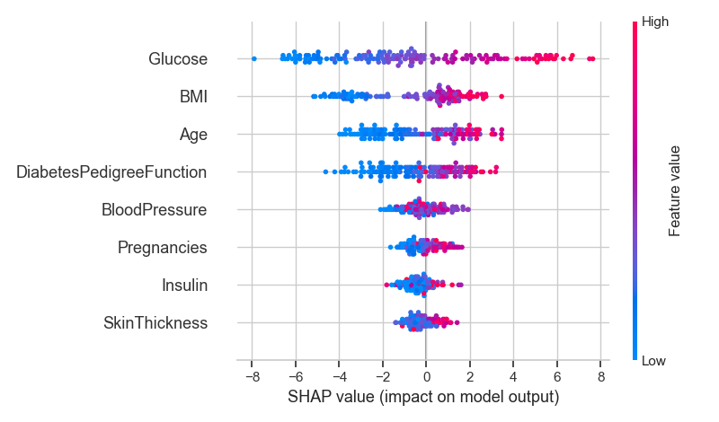
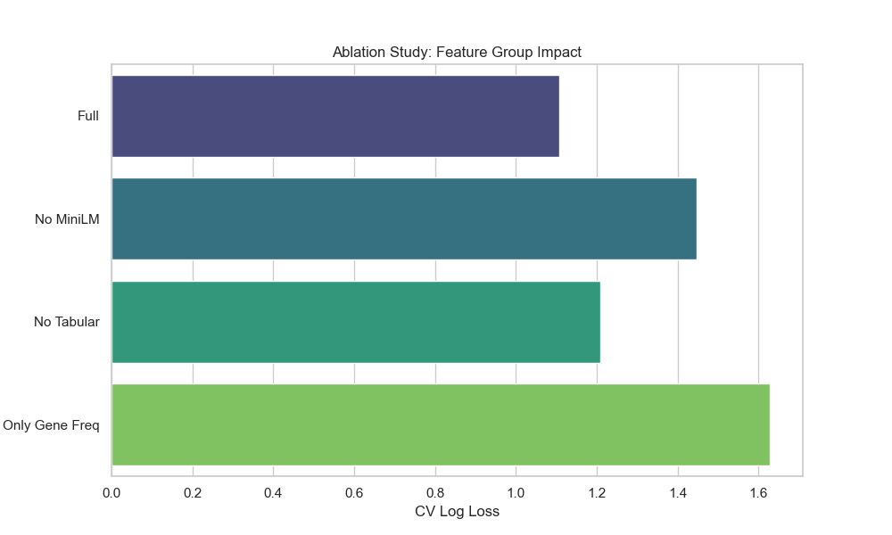
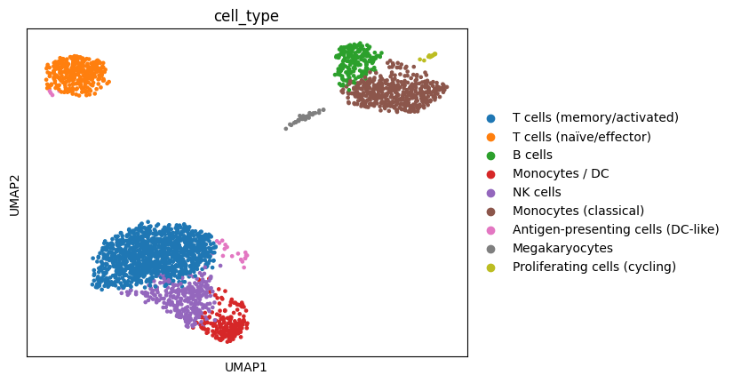

# 📊 Data Science Portfolio

Welcome to my **Data Science & Machine Learning portfolio**.  
This repository contains **10 end-to-end projects** across **healthcare, genomics, NLP, computer vision, and classic tabular ML**.

Each project includes:
- 📂 **Full code & notebooks** (EDA → preprocessing → modeling → evaluation)
- 📊 **Figures & visualizations** (EDA plots, SHAP values, model evaluation)
- 📑 **Detailed README** (objective, workflow, results, key insights, future work)

---

## 🎯 About This Portfolio
These projects demonstrate my ability to:
- Work with **structured, unstructured, biomedical, and image data**.
- Apply **ML, Deep Learning, NLP, and Explainable AI techniques**.
- Handle **imbalanced datasets, dimensionality reduction, and model optimization**.
- Deliver **robust, reproducible, and interpretable pipelines**.

---

## 📌 Projects Overview

| Project | Domain | Objective | Key Techniques | Results |
| --- | --- | --- | --- | --- |
| 🚢 [Titanic Survival](titanic-survival-prediction/) | Tabular ML | Predict survival of Titanic passengers | Feature Engineering, XGBoost, Stacking | Stacking AUC 0.87 |
| 🏠 [Boston Housing](boston-housing-regression/) | Regression | Predict housing prices | Polynomial FE, XGBoost, SHAP | XGBoost R² = 0.93 |
| ❤️ [Heart Disease](heart-disease-prediction/) | Healthcare | Predict heart disease presence | Logistic Regression, SVC, SHAP | LogReg AUC = 0.97 |
| 🧬 [Breast Cancer](breast-cancer-classification/) | Healthcare | Classify tumors (malignant/benign) | PCA, LightGBM, SMOTE | LightGBM AUC = 0.997 |
| 💉 [Pima Diabetes](pima-indians-diabetes/) | Healthcare | Predict diabetes | CatBoost, Stacking, SHAP | CatBoost AUC = 0.91 |
| 🧪 [RNA-Seq Cancer](gene-expression-cancer/) | Genomics | Classify cancer types from RNA-Seq | PCA, Logistic Regression, SHAP | F1 Macro = 1.0 |
| 📚 [CORD-19 NLP](covid19-cord19-nlp/) | NLP Biomedical | Analyze COVID-19 papers | LDA, TF-IDF, BioBERT | Semantic retrieval system |
| 🔬 [Protein Atlas](human-protein-atlas/) | Computer Vision | Multi-label protein localization | CNN, ResNet18 (4 channels) | Macro F1 = 0.21 |
| 🧬 [Personalized Medicine](personalized-medicine-cancer/) | Genomics + NLP | Classify mutation effects | MiniLM embeddings, XGBoost, SHAP | Log Loss ≈ 1.1 |
| 🧫 [PBMC3k scRNA-seq](scrna-seq-pbmc3k/) | Single-Cell Genomics | Identify & classify immune cell types | Scanpy, PCA/UMAP, Leiden, Random Forest, SHAP | 9 clusters, RF AUC = 0.98 |

---

## 🗂 Repository Structure
📦 data-science  
┣ 📜 README.md                      # Global README (this file)  
┣ 📂 titanic-survival-prediction/   # Project 1  
┣ 📂 boston-housing-regression/     # Project 2  
┣ 📂 heart-disease-prediction/      # Project 3  
┣ 📂 breast-cancer-classification/  # Project 4  
┣ 📂 pima-indians-diabetes/         # Project 5  
┣ 📂 gene-expression-cancer/        # Project 6  
┣ 📂 covid19-cord19-nlp/            # Project 7  
┣ 📂 human-protein-atlas/           # Project 8  
┣ 📂 personalized-medicine-cancer/  # Project 9  
┣ 📂 scrna-seq-pbmc3k/              # Project 10  

---

## 🎨 Visual Highlights
Here are some sample results:

- 💉 Pima Diabetes → **SHAP summary plot**  
  

- 🧬 Personalized Medicine → **Ablation study**  
  

- 🧫 PBMC3k scRNA-seq → **UMAP clusters**  
  

---

## 📩 Contact
👤 **Jérémy Goetschy**  
📧 jeremygoetschy0@gmail.com
